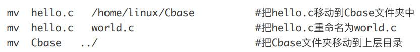
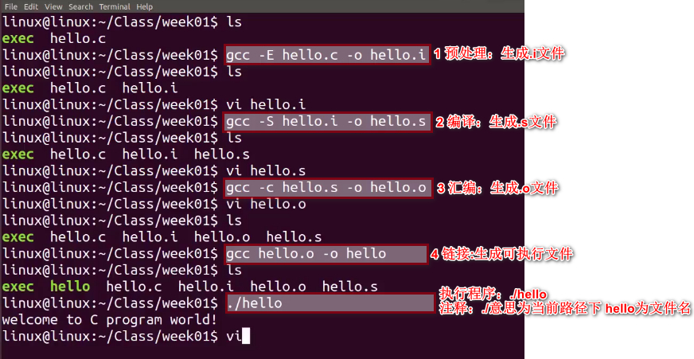

## linux命令相关：

创建文件夹```mkdir ```

删除文件夹``` rm -rf dirtest```

创建文件 ```touch log.txt ```

删除文件``` rm log.txt```

复制⽂件 / ⽂件夹到指定⽬录
 ```cp ``` / ```mv```

```cp hello.c /home/linux/Cbase  ``` 把hello.c复制到Cbase⽂件夹中

```cp hello.c world.c     ```把hello.c 复制⼀份命名为world.c

```cp Cbase ../ -a        ```把Cbase⽂件夹拷⻉到上层⽬录



```mv hello.c world.c ```把hello.c重命名为world.c
```cp hello.c world.c``` 
//把hello.c 复制⼀份命名为world.c


### gcc
