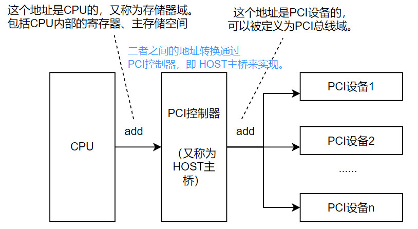
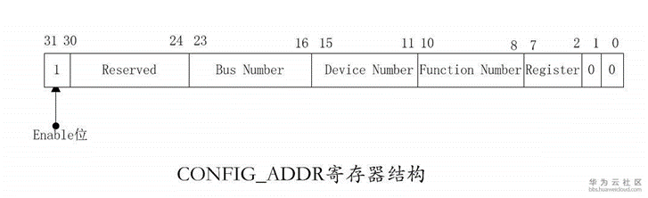
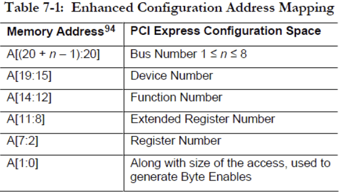

博文：
https://blog.csdn.net/qq_39815222/article/details/121047739?utm_medium=distribute.pc_relevant.none-task-blog-2~default~baidujs_baidulandingword~default-1-121047739-blog-98945414.235^v43^pc_blog_bottom_relevance_base1&spm=1001.2101.3001.4242.2&utm_relevant_index=2

https://blog.csdn.net/jw212/article/details/6117997


***
在windows上通过wmic命令获得PCI设备

``` c
wmic path win32_pnpentity where "deviceid like '%PCI%'" get name,deviceid
```
***
UEFI BIOS 提供了两个主要的模块来支持PCI 总线，一个是PCI Host Bridge 控制器驱动（也就是主桥），另一个是PCI 总线驱动。 

一、 PCI地址空间划分

# 存储器域和PCI总线域

PCI spec规定了PCI设备必须提供的单独地址空间，因此CPU可以访问的地址空间和PCIe设备的地址空间是分开的。

看这张图更直观，两个地址区域是隔离的，  


根据王齐老师的**《PCI Express体系结构导读》**一书，前者可以被定义为存储器域，该域包括CPU内部的寄存器、主存空间，即CPU域和DRAM域（在可以接入显卡等设备的处理器系统中，CPU域并不能包含所有的DRAM域）;
而后者可以被定义为PCI总线域。二者之间的地址转换通过PCIe HOST主桥来实现。

存储器域和PCI域相互访问需要先进行地址映射，即当CPU要访问PCI外部设备时（正向映射），需要先访问该设备在存储器域的地址，之后经过HOST主桥转换为PCI总线域的物理地址，然后通过PCI总线事务进行数据访问;而当PCI设备访问主存储器时（反向映射），首先通过PCI总线事务访问PCI总线域的地址空间，然后经过HOST主桥转换为存储器域的地址后，再对这些空间进行数据访问。

在PCI体系结构中一共支持两种地址空间。进一步地，PCI总线域可以进一步划分为Configuration Address Space（配置空间）。和Memory Address Space（MMIO 存储器映射空间）。

## 配置空间（configuration space）
配置空间,前64个字节（其地址范围为0x00～0x3F）是所有PCI设备必须支持的（有不少简单的设备也仅支持这些），此外PCI/PCI-X还扩展了0x40~0xFF这段配置空间，在这段空间主要存放一些与MSI或者MSI-X中断机制和电源管理相关的Capability结构。

## MMIO空间(Memory mapping I/O)
MMIO即内存映射I/O，它是PCI规范的一部分，I/O设备被放置在内存空间而不是I/O空间。从处理器的角度看，内存映射I/O后系统设备访问起来和内存一样。
这样如果访问AGP/PCI-E显卡上的帧缓存，BIOS可以对PCI设备使用读写内存一样的汇编指令完成，简化了程序设计的难度和接口的复杂性。
I/O作为CPU和外设交流的一个渠道，主要分为两种，一种是Port I/O，一种是MMIO。

# 地址转换
outbound/inbound机制  
部分PCIe控制器的设计中采用inbound和outbound寄存器组来保存存储器域和PCIe域的地址转换关系。

### outbound寄存器组  
outbount寄存器实现存储器域地址向PCIe域地址的转换。
只有当CPU读写访问的地址范围在outbound寄存器组管理的地址空间内时，HOST主桥才能接收CPU的读写访问，并将CPU在存储器域上的读写访问转换为PCI总线域上的读写访问，然后才能对PCI设备进行读写操作

### inbound寄存器组
inbound寄存器实现PCIe的地址向CPU域地址的转换

转换公式为：


```
Physical_Address = MMIO_Starting_Physical_Address + ((bus - MMIO_Starting_Bus) << 20 | device << 15 | func << 12) + offset
```

当处理器访问PCI设备的地址空间时，首先需要访问该设备在存储器域的地址空间，并通过HOST主桥蒋这个存储器域的地址空间转换为PCI总线域的地址空间后，在使用PCI总线事务将数据发送给PCI设备。
同样，PCI设备访问存储器域的地址空间，类似进行DMA操作时，首先访问该存储器地址空间所对应的PCI总线地址空间，之后通过HOST主桥将PCI地址转换为存储器地址
    
地址映射方式
存储器访问的地址映射方式计算方法为：
PCIe总线域地址 = 请求访问的存储器域地址 - MMIO基地址 + bar基址（RP）

计算结果PCIe总线域地址在PCIe总线上广播，当该地址在某PCI设备的bar地址空间范围内，则访问该设备的地址空间。

# PCI设备的config配置空间访问
上文提到，PCI总线域的地址空间分为配置空间、memory空间和IO空间，对于配置空间的访问，一般有两种访问机制，一是通过特定寄存器访问，二是通过ECAM的方式访问。

无论是哪种访问方式，都需要对所有的PCI设备进行编码以避免冲突，通常以三段编码来区分PCI设备，即Bus Number, Device Number和Function Number，可以简称为BDF，也成为ID号。通过BDF（ID号）可以唯一确定一个PCI设备。


由于PCIe总线树上可能存在Bridge接终端设备，或者直接接ep设备，因此对二者的配置空间访问请求也有所不同，对上述设备分别是用Type1和Type0配置请求。

具体访问方法如下：
## 1通过特定寄存器寻址访问
PCI总线规定访问第三节的配置空间的总线事务，即配置读写总线事务，使用ID号进行寻址。

对于x86架构来说，一般通过CONFIG_ADDRESS和CONFIG_FATA寄存器，CFG_ADDR寄存器和CFG_DATA寄存器用来访问PCI设备的配置空间。

### CFG_ADDR寄存器
CFG_ADDR寄存器中保存了PCI设备的ID号和寄存器号，如图所示。


该寄存器有字段：

enable位  
当该位为1时，host主桥使能对PCI设备配置空间的访问，当HOST处理器对CFGPDAT寄存器访问时，HOST主桥将对该机存起访问转换位PCI哦诶值读写总线事务并发送的PCI总线上。

Bus Number  
记录PCI设备的总线号，总线号在HOST主桥时确定，PCI总线可以使用PCI桥扩展PCI总线并形成一颗PCI总线树。在一颗PCI总线树中，总线号由系统软件决定，通常与HOST主桥直接连接的PCI总线编号为0，系统软件使用DFS算法扫描PCI总线树上的所有PCI总线，并依次编号

Device Number  
记录PCI设备的设备号，设备号由PCI设备的IDSEL信号与PCI总线地址先的连接关系确定

Function Number  
记录PCI设备的功能号，功能号与PCI设备的具体设计相关。一个PCI设备最多有8个功能设备，且每一个功能设备都有各自的PCI配置空间，二在绝大多数PCI设备中只有一个功能设备。

Register Number  
记录PCI设备的配置寄存器号

## 2 ECAM
增强配置访问机制，ARM使用ECAM的方式访问PCIe配置空间。ECAM是一个将配置空间映射到MEMORY空间的规则。硬件根据ECAM的方式将某个Memory空间映射给PCI配置空间，CPU访问对应的memory空间即可以操作PCIe配置空间，其地址空间映射如下：


在ACPI规范中，需要通过MCFG表上报ECAM的地址映射。完成映射后，CPU发出的地址如果落在ECAM的范围内， 根据对应的bdf就可以访问到对应ep的配置空间了。


拿到项目代码之后，看histroy的最后一行，方括号里有个字段，去搜那个字段，然后把那个字段的代码，粘贴到纯净的代码中，纯净的代码指的是我电脑中ADL那个。
每个项目里有个OEM的包，


 

