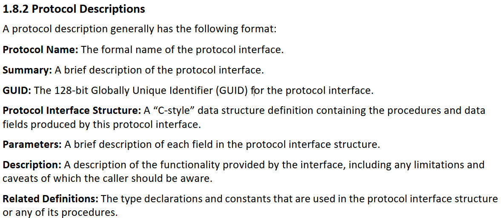

# uefi


介绍UEFI 规范如何支持PCI 总线，以及UEFI 固件中PCI 总线驱动的实现 。https://maxwell.blog.csdn.net/article/details/98945414?spm=1001.2014.3001.5502

---
# Spec文档学习：
## 1 简介
This Unified Extensible Firmware Interface (UEFI) Specification describes an interface between the
operating system (OS) and the platform firmware.

The intent of this specification is to define a way for the OS and platform firmware to communicate only
information necessary to support the OS boot process.

Access to boot devices is provided through a set of protocol interfaces。

The UEFI Driver Model is designed to support the execution of modular pieces of code, also known as
drivers, that run in the preboot environment. These drivers may manage or control hardware buses and
devices on the platform, or they may provide some software-derived, platform-specific service.

The UEFI Specification describes how to write PCI bus drivers, PCI device drivers, USB bus drivers, USB device drivers, and SCSI drivers. Additional details are provided that allow UEFI drivers to be stored in PCI option ROMs, while maintaining compatibility with legacy option ROM images.



UEFI uses a subset of the PE32+ image format with a modified header signature. The modification to the signature value in the PE32+ image is done to distinguish UEFI images from normal PE32 executables. The
“+” addition to PE32 provides the 64-bit relocation fix-up extensions to standard PE32 format.

A UEFI image is loaded into memory through the ```EFI_BOOT_SERVICES.LoadImage() ```Boot Service.
This service loads an image with a PE32+ format into memory. This PE32+ loader is required to load all
sections of the PE32+ image into memory. Once the image is loaded into memory, and the appropriate
fix-ups have been performed, control is transferred to a loaded image at the AddressOfEntryPoint
reference according to the normal indirect calling conventions of applications based on supported 32-bit,
64-bit, or 128-bit processors. All other linkage to and from an UEFI image is done programmatically.


