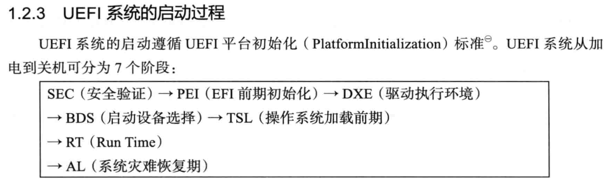
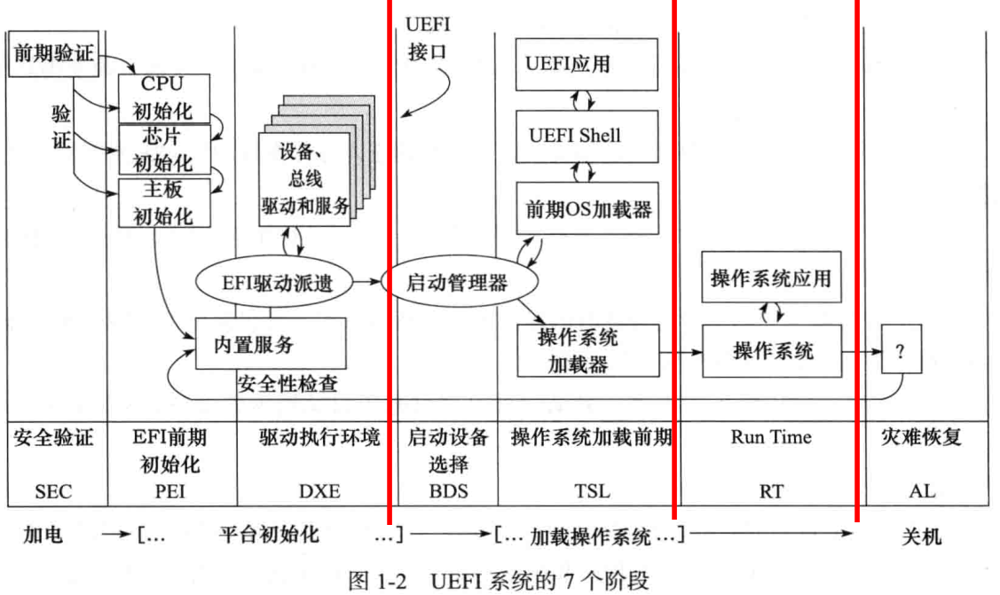
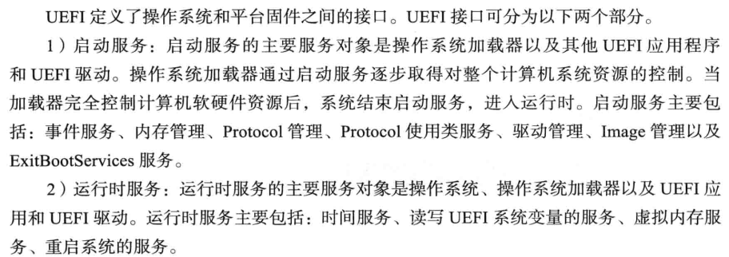
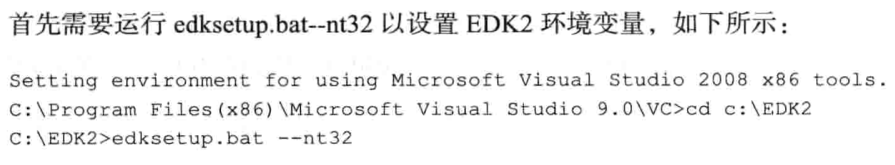
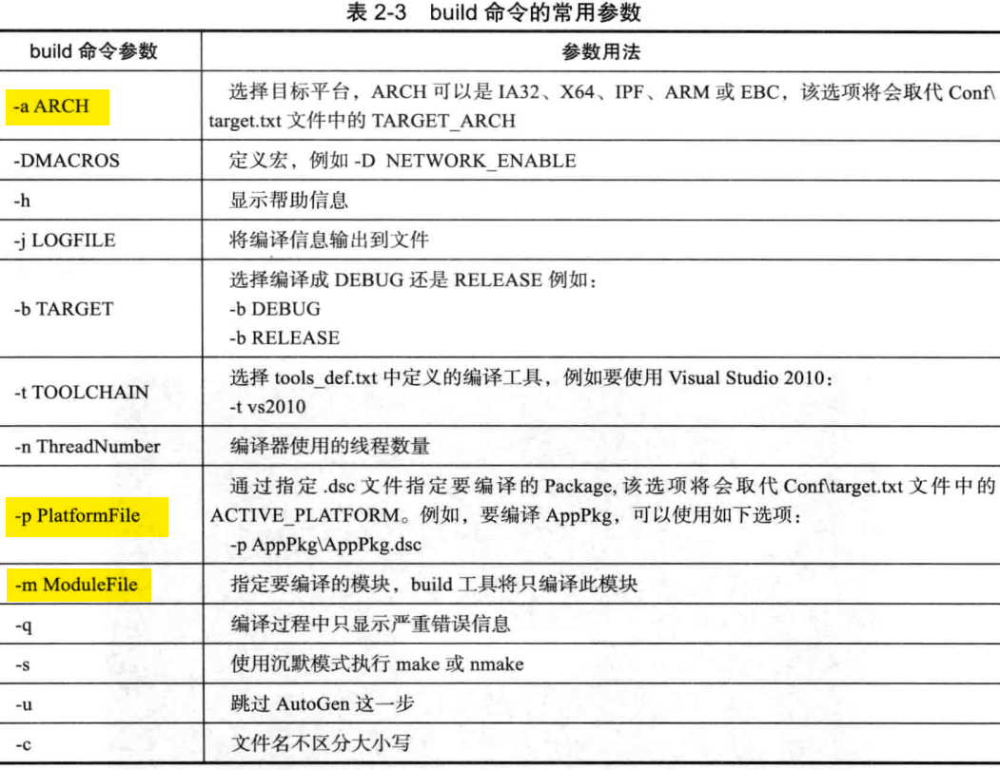
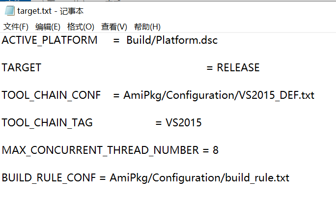

如何添加新的驱动模块

每个驱动文件最起码包含一个.inf文件及一个.c文件，具体可参考“DxeDriver参考.rar”。
.inf文件用于定义你的驱动类型，用到的libraryclasses等，关于.inf文件的详细描述详见文档第二章。.c文件用于编写你的程序实现。 

/home/zhang/kunlun-crb-code-ft-e2000-master-24d14f1f1ee8115bdfbab3004f1b38544a0b7c87/Kunlun/KunlunE2000BoardPkg/pbf


高速IO（High-Speed I/O）和"低速IO"（Low-Speed I/O）是指输入/输出设备与系统的数据传输速率。

1. **高速IO**:
   - 通常指的是那些数据传输速率非常高的设备和接口，例如PCIe（Peripheral Component Interconnect Express）、SATA（Serial ATA）、USB 3.0/3.1/3.2、Thunderbolt等。
   - 高速IO设备能够快速地与处理器或内存交换大量数据，适合需要快速数据传输的应用，如高端图形处理、大容量数据存储和传输等。

2. **低速IO**:
   - 指的是数据传输速率相对较低的设备和接口，例如传统的串行端口、并行端口、USB 1.1、I2C、SPI等。
   - 低速IO通常用于不需要快速数据传输的应用，如某些传感器、低速网络设备、部分外围设备等。

3. **应用场景**:
   - 高速IO常用于高性能计算、数据中心、高端游戏、专业图形工作站等场景。
   - 低速IO则更常见于嵌入式系统、某些工业控制应用、低成本设备等。

4. **技术规格**:
   - 高速IO接口通常具有更高的数据传输速率、更复杂的协议和更严格的时序要求。
   - 低速IO接口则相对简单，成本较低，但数据传输能力有限。

5. **系统设计考虑**:
   - 在系统设计时，需要根据应用需求选择合适的IO接口。高速IO可以提供更好的性能，但可能伴随更高的成本和功耗。
   - 低速IO虽然性能有限，但在许多应用中已经足够，并且可以降低系统成本。

6. **未来发展**:
   - 随着技术的发展，高速IO的速率还在不断提升，同时，低速IO也在不断优化以满足特定应用的需求。

7. **兼容性**:
   - 在某些情况下，高速和低速IO设备可能需要通过适配器或转换器实现兼容性。
  

---


## vscode中通过ssh远程登陆虚拟机

- 1、在vscode安装Remote Development插件

- 2、使用ifconfig命令获取ubuntu的ip地址

- 3、在windows 命令提提示符中看能否ping通

- 4、打开vscode，按ctrl+shift+p 选择all，在顶栏输入Remote add 选择，添加虚拟机地址：ssh linux@IP地址，然后选择有.ssh的那一栏。

- 5、然后刷新。按照提示输入密码就可以连接了。


## 内存知识


DDR4和LPDDR4
是两种不同类型的动态随机存取存储器（DRAM）技术。

- DDR4主要用于桌面计算机、服务器和高性能计算系统，而LPDDR4主要用于移动设备和低功耗应用。
- DDR4提供更高的数据传输速率和性能
- DDR4通常在1.2V下运行，LPDDR4在1.1V运行，而DDR3在1.5V，有助于减少能耗。
---






SEC（SecurityPhase）阶段是平台初始化的第一个阶段，计算机系统加电后进入这个阶段。
- （1）SEC阶段的功能
UEFI系统开机或重启进入SEC阶段，从功能上说，它执行以下4种任务。
1）接收并处理系统启动和重启信号：系统加电信号、系统重启信号、系统运行过程中的严重异常信号。
2）初始化临时存储区域：系统运行在SEC阶段时，仅CPU和CPU内部资源被初始化，
各种外部设备和内存都没有被初始化，因而系统需要一些临时RAM区域，用于代码和数据的存取，我们将之称为临时RAM，以示与内存的区别。这些临时RAM只能位于CPU内部。最常用的临时RAM是Cache，当Cache被配置为no-eviction模式时，可以作为内存使用，读命中时返回Cache中的数据，读缺失时不会向主存发出缺失事件：写命中时将数据写入Cahce，写缺失时不会向主存发出缺失事件，这种技术称为CAR（CacheAsRam）。




**<font color=red>UEFI是一种标准，它没有给出具体的实现。软件商可以根据UEFI标准开发自已的UEFI实现。其中常用的开源实现是EDK2。</font>**
**EDK2是遵循 UEFI标准和PI标准的跨平台固件开发环境。**

UEFI的目标是完全取代BIOS，因而它要能完全支持所有类型的CPU，并让所有的硬件厂商接受这种变化。来自不同厂商的开发者使用各种不同的开发环境开发自已的产品。为了让不同的开发者愉快地接受EDK2来开发自已平台上的UEFI固件或应用，EDK2对每种平台都提供了对应的开发工具。
EDK2支持在多种操作系统下的开发，例如Windows、Linux、Darwin、UNIX等，并支持跨平台编译，如在WindoWs开发环境下可以编译出Arm平台上的UEFI应用程序。

.asl是高级配置与电源接口源文件

利用EDK2提供的工具链进行编译，以及重要参数
在CMD命令行中编译UEFI代码，通过运行EDK2工具链命令完成。

分两种情况：
- 一是编译UEFI模拟器工程（Nt32Pkg工程）

- 二是编译其他UEFI工程（非模拟器）
首先设置环境变量，
- 
设置好环境变量后，使用EDK2提供的build工具编译UEFI代码了。例如，要编译MdePkg：
C:\lEDK2> ```build -a X64 -p MdePkg\MdePkg.dsc```

build命令是编译UEFI工程常用的命令。有三个重要参数：-a、-p和-m。
- ```-a```用来选择目标平台。
  可供选择的选项有IA32（32位x86 CPU）、X64（64位x86_64 CPU）、IPF（Itanium Processor Family）、ARM和EBC（EFI byte code）；默认的参数在Conf/target.txt中设置。
- ```-p```用来指定要编译的package或Platform。
  -p的参数是这个package或Platform的.dsc 文件。默认的参数在Conf/target.txt中设置。
- ```-m```用来指定要编译的模块。
  如果不指定-m选项，build将编译.dsc文件指定的所有模块。
  

在windows下开发，要建一个文件。项目工程文件夹\Conf\target.txt


## 如何在EDK2环境下编程。
EDK2的两个概念：模块（Module）和包（Package）。
EDK2根日录下，有很多以*PKg命名的文件夹，“包”是一组模块及平台描述文件（.dsc文件）、包声明文件（.dec文件）组成的集合。
模块是UEFI系统的一个特色。模块（可执行文件即.efi文件）像插件一样可以动态地加载到UEFI内核中。对应到源文件，EDK2中的每个工程模块由元数据文件（f文件）和源文件（有些情况下也可以包含.ef文件）组成。

在Windows下使用VS（VisualStudio）时通常要建立工程文件和源文件。
在Linux下编程，除了编写源代码之外，还要编写Makefile文件。与之相似，在EDK2环境下，我们除了要编写源文件外，还要为工程编写元数据文件（.inf)。

**.inf文件用于自动编译源代码，与VS的工程文件及Linux下的Makefile文件功能相似，**


包相当于VS中的项目。
模块相当于VS项目中的工程，

```.inf```:.inf文件则相当于VS工程的.proj文件。
```.dsc```:.dsc文件则相当于 VS项目的.sln文件；
```.inf```:
```.inf```:
```.inf```:
