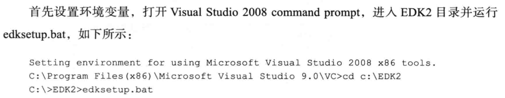

如何添加新的驱动模块

每个驱动文件最起码包含一个.inf文件及一个.c文件，具体可参考“DxeDriver参考.rar”。
.inf文件用于定义你的驱动类型，用到的libraryclasses等，关于.inf文件的详细描述详见文档第二章。.c文件用于编写你的程序实现。 

/home/zhang/kunlun-crb-code-ft-e2000-master-24d14f1f1ee8115bdfbab3004f1b38544a0b7c87/Kunlun/KunlunE2000BoardPkg/pbf


高速IO（High-Speed I/O）和"低速IO"（Low-Speed I/O）是指输入/输出设备与系统的数据传输速率。

1. **高速IO**:
   - 通常指的是那些数据传输速率非常高的设备和接口，例如PCIe（Peripheral Component Interconnect Express）、SATA（Serial ATA）、USB 3.0/3.1/3.2、Thunderbolt等。
   - 高速IO设备能够快速地与处理器或内存交换大量数据，适合需要快速数据传输的应用，如高端图形处理、大容量数据存储和传输等。

2. **低速IO**:
   - 指的是数据传输速率相对较低的设备和接口，例如传统的串行端口、并行端口、USB 1.1、I2C、SPI等。
   - 低速IO通常用于不需要快速数据传输的应用，如某些传感器、低速网络设备、部分外围设备等。

3. **应用场景**:
   - 高速IO常用于高性能计算、数据中心、高端游戏、专业图形工作站等场景。
   - 低速IO则更常见于嵌入式系统、某些工业控制应用、低成本设备等。

4. **技术规格**:
   - 高速IO接口通常具有更高的数据传输速率、更复杂的协议和更严格的时序要求。
   - 低速IO接口则相对简单，成本较低，但数据传输能力有限。

5. **系统设计考虑**:
   - 在系统设计时，需要根据应用需求选择合适的IO接口。高速IO可以提供更好的性能，但可能伴随更高的成本和功耗。
   - 低速IO虽然性能有限，但在许多应用中已经足够，并且可以降低系统成本。

6. **未来发展**:
   - 随着技术的发展，高速IO的速率还在不断提升，同时，低速IO也在不断优化以满足特定应用的需求。

7. **兼容性**:
   - 在某些情况下，高速和低速IO设备可能需要通过适配器或转换器实现兼容性。
  

---


## vscode中通过ssh远程登陆虚拟机

- 1、在vscode安装Remote Development插件

- 2、使用ifconfig命令获取ubuntu的ip地址

- 3、在windows 命令提提示符中看能否ping通

- 4、打开vscode，按ctrl+shift+p 选择all，在顶栏输入Remote add 选择，添加虚拟机地址：ssh linux@IP地址，然后选择有.ssh的那一栏。

- 5、然后刷新。按照提示输入密码就可以连接了。


## 内存知识


DDR4和LPDDR4
是两种不同类型的动态随机存取存储器（DRAM）技术。

- DDR4主要用于桌面计算机、服务器和高性能计算系统，而LPDDR4主要用于移动设备和低功耗应用。
- DDR4提供更高的数据传输速率和性能
- DDR4通常在1.2V下运行，LPDDR4在1.1V运行，而DDR3在1.5V，有助于减少能耗。
---


SEC（SecurityPhase）阶段是平台初始化的第一个阶段，计算机系统加电后进入这个阶段。
- （1）SEC阶段的功能
UEFI系统开机或重启进入SEC阶段，从功能上说，它执行以下4种任务。
1）接收并处理系统启动和重启信号：系统加电信号、系统重启信号、系统运行过程中的严重异常信号。
2）初始化临时存储区域：系统运行在SEC阶段时，仅CPU和CPU内部资源被初始化，
各种外部设备和内存都没有被初始化，因而系统需要一些临时RAM区域，用于代码和数据的存取，我们将之称为临时RAM，以示与内存的区别。这些临时RAM只能位于CPU内部。最常用的临时RAM是Cache，当Cache被配置为no-eviction模式时，可以作为内存使用，读命中时返回Cache中的数据，读缺失时不会向主存发出缺失事件：写命中时将数据写入Cahce，写缺失时不会向主存发出缺失事件，这种技术称为CAR（CacheAsRam）。


**<font color=red>UEFI是一种标准，它没有给出具体的实现。软件商可以根据UEFI标准开发自已的UEFI实现。其中常用的开源实现是EDK2。</font>**
**EDK2是遵循 UEFI标准和PI标准的跨平台固件开发环境。**

UEFI的目标是完全取代BIOS，因而它要能完全支持所有类型的CPU，并让所有的硬件厂商接受这种变化。来自不同厂商的开发者使用各种不同的开发环境开发自已的产品。为了让不同的开发者愉快地接受EDK2来开发自已平台上的UEFI固件或应用，EDK2对每种平台都提供了对应的开发工具。
EDK2支持在多种操作系统下的开发，例如Windows、Linux、Darwin、UNIX等，并支持跨平台编译，如在WindoWs开发环境下可以编译出Arm平台上的UEFI应用程序。

.asl是高级配置与电源接口源文件

利用EDK2提供的工具链进行编译，以及重要参数
在CMD命令行中编译UEFI代码，通过运行EDK2工具链命令完成。

分两种情况：
- 一是编译UEFI模拟器工程（Nt32Pkg工程）

- 二是编译其他UEFI工程（非模拟器）
首先设置环境变量，
- 
设置好环境变量后，使用EDK2提供的build工具编译UEFI代码了。例如，要编译MdePkg：
C:\lEDK2> ```build -a X64 -p MdePkg\MdePkg.dsc```

build命令是编译UEFI工程常用的命令。有三个重要参数：-a、-p和-m。
- ```-a```用来选择目标平台。
  可供选择的选项有IA32（32位x86 CPU）、X64（64位x86_64 CPU）、IPF（Itanium Processor Family）、ARM和EBC（EFI byte code）；默认的参数在Conf/target.txt中设置。
- ```-p```用来指定要编译的package或Platform。
  -p的参数是这个package或Platform的.dsc 文件。默认的参数在Conf/target.txt中设置。
- ```-m```用来指定要编译的模块。
  如果不指定-m选项，build将编译.dsc文件指定的所有模块。
  

在windows下开发，要建一个文件。项目工程文件夹\Conf\target.txt


## 如何在EDK2环境下编程。
EDK2的两个概念：模块（Module）和包（Package）。
- 包相当于VS中的项目。
- 模块相当于VS项目中的工程


EDK2根日录下，有很多以*PKg命名的文件夹，
- “包”是一组模块及平台描述文件（.dsc文件）、包声明文件（.dec文件）组成的集合。
- 模块是UEFI系统的一个特色。模块（可执行文件即.efi文件）像插件一样可以动态地加载到UEFI内核中。
- 对应到源文件，EDK2中的每个工程模块由元数据文件（.inf文件）和源文件（有些情况下也可以包含.ef文件）组成。

在Windows下使用VS（VisualStudio）时通常要建立工程文件和源文件。
在Linux下编程，除了编写源代码之外，还要编写Makefile文件。与之相似，在EDK2环境下，我们除了要编写源文件外，还要为工程编写元数据文件（.inf)。

**.inf文件用于自动编译源代码，与VS的工程文件及Linux下的Makefile文件功能相似。**


包相当于VS中的项目。
模块相当于VS项目中的工程，

```.inf```:元数据，.inf文件则相当于VS工程的.proj文件。inf文件是模块的工程文件，作用相当于makefile或者visualstudio的.proj文件，**<font color=red>用于指导EDK2编译工具自动编译模块。</font>** 用于编译一个模块。
```.dsc```:平台描述，.dsc文件则相当于 VS项目的.sln文件,一个解决方案下含有多个项目。用于指导编译整个package。
```.dec```:用于向其他工程模块提供本Packages资源。
```.efi```:模块,（UEFI应用程序或UEFI驱动程序）加载到内存后生成的对象称为Image（映像）


一般来说，标准应用程序至少要包含以下两个部分。
1）头文件：所有的UEFI程序都要包含头文件Uefi.h。Uefi.h定义了UEFI基本数据类
型及核心数据结构。
2）入口函数：UEFI标准应用程序的入口函数通常是UefiMain。之所以说通常是
UefiMain而不是说必须是UefiMain，是因为入口函数可由开发者指定。
UefiMain只是一个纳定俗成的函数名。入口函数由工程文件UefiMain.inf指定。虽然入口函数的函数名可以变化，但其函数签名（即返回值类型和参数列表类型）不能变化。


- 入口函数的返回值类型是EFISTATUS。
   - 在UEFI程序中基本所有的返回值类型都是EFISTATUS。它本质上是无符号长整数
  - 最高位为1时其值为错误代码，为0时表示非错误值。通过宏EFIERROR(Status）可以判断返回值Status是否为错误码。若Status为错误码，EFIERROR(Status）返回真，否则返回假。
- EFISUCCESS为预定义常量，其值为0，表示没有错误的状态值或返回值。 入口函数的参数ImageHandle和SystemTable。

   - .efi文件（UEFI应用程序或UEFI驱动程序）加载到内存后生成的对象称为Image（映像）。ImageHandle是Image对象的句柄，作为模块入口函数参数，它表示模块自身加载到内存后生成的Image对象。
   - SystemTable是程序同UEFI内核交互的桥梁，通过它可以获得UEFI提供的各种服务，如启动（BT）服务和运行时（RT）服务。SystemTable是UEFI内核中的一个全局结构体。

.fdf文件用于生成固件的Image、OPtion RomImage 或可启动Image。


# CH4 UEFI中的Protocol

从字面意思上理解，Protocol是服务器和客户端之间的一种约定，双方约定来互通信息。提供服务的称为服务器，使用服务的称为客户端。举个例子：
- TCP是一种Protocol，客户端（应用程序）通过一组函数来压缩包和解压包，压缩包和解压包是服务器提供的服务。
- COM也是一种Protocol，客户端通过CoCreateInstance（...）和GUID获得指向COM对象的指针，然后使用该指针获得COM对象提供的服务，GUID标示了这个COM对象。

具体到UEFI里，Protocol是什么样子呢？如何得到Protocol对应的对象？

UEFI是用C语言来实现的，但C语言是面向过程的。完全使用面向过程的思想来管理和使用众多的UEFIProtocol会使程序变得非常复杂。Protocol作为一种对象来设计管理会比较直观。

<font color=red>
因而UEFI中的Protocol引入了面向对象的思想：

- 用struct来模拟class。
- 用函数指针（Protocol的成员变量）模拟成员函数，此种函数的第一参数必须是指向Protocol的指针，用来模拟this指针.
</font>

firmware management capsule。在计算机系统中，固件管理胶囊通常用于更新或管理固件。


---
笔记

安装虚拟机
使用里配置好的虚拟机环境直接打开
复制或者删除目录时 如果要复制某个文件夹下的所有文件，递归的复制，需要添加参数 ```-r```

改变文件权限```chmod -R 777```

代码补全工具有
1、IntelliCode、2、TabNine、3、Kite。其中，TabNine基于深度学习，提供了非常智能和高效的代码补全功能

git相关，是分布式的。而SVN是集中式的。
集中式和分布式的主要区别，集中式只有一个档案馆。分布式可以每人有一个档案馆，可以在自己的档案管里自己处理自己的版本。
--------------------------------
在Git中配置用户名和邮箱是一个重要的步骤，‌它确保了每次提交记录都能带有正确的身份信息。

github、gitlab、gitee和git之间的关系，前面三个者是后者的托管平台。

右键打开gitbash进行操作。
初次使用时要进行基础的配置，对自己的身份进行说明。 
git config --global user.name "Joayzhang" //想要显示的用户名 

git config --global user.email "zymelon@163.com" //实际的邮箱地址。‌

配置好之后查看配置的命令
‌验证配置‌：‌使用命令git config --global user.name和git config --global user.email查看已配置的用户名和邮箱。‌
‌用户名和邮箱是用于标识每次代码提交者的信息‌。‌此信息帮助团设置全局的用户名和邮箱，将应用于所有的Git仓库，‌也可以在特定的Git仓库中设置独立的用户名和邮箱。
‌Git配置的用户名和邮箱与GitHub登录的用户名和邮箱可以不一样‌。‌Git配置的用户名和邮箱主要用于版本控制中的追踪，‌记录提交者的身份，‌而GitHub登录的用户名和邮箱则用于身份验证和访问控制。‌尽管它们可以不同，‌但为了方便GitHub正确记录贡献和避免混淆，‌建议将Git配置的用户名和邮箱与GitHub账户的用户名和邮箱设置为一致‌。
## 创建仓库
在本地创建一个项目，在这个目录下打开git bash执行命令 git init
使用clone 命令来克隆（下载）github上的项目。
```git   clone 项目网址```
使用git add 命令去跟踪文件。

如果想让文件不被跟踪使用git rm 命令删除即可。


提交此次修改 git commit 


使用这条命令去链接远程仓库
 


