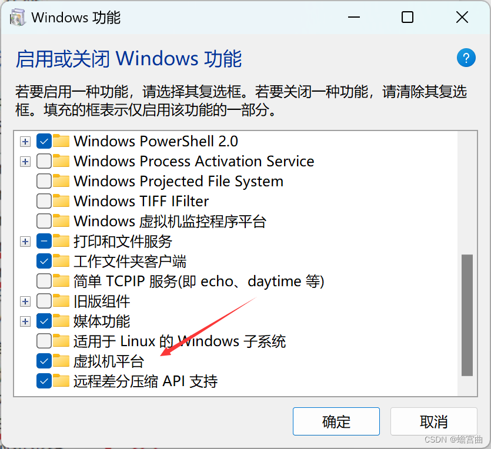
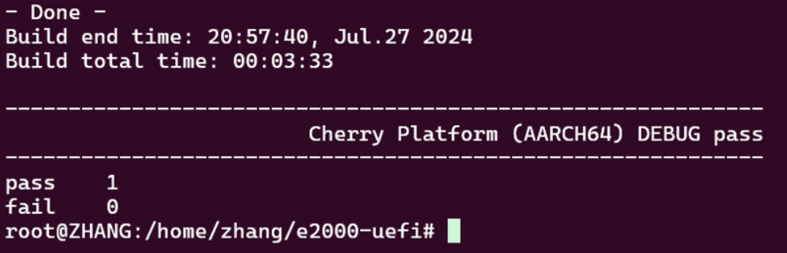

# 一、系统安装步骤

在windows中通过WSL2建立ubuntu子系统。或用VM虚拟机，安装 VMware Workstation Pro右击要以管理员方式安装。

设置：
要在Window功能中勾选虚拟机平台（开始菜单搜索控制面板，启用/关闭功能），点确定，重启电脑。如图：


方法参考：
https://learn.microsoft.com/zh-cn/windows/wsl/install-manual


切换root用户，命令```sudo su```

# 二、环境建立步骤

## 1、在根目录下安装那几个依赖包；


编译 UEFI 需要添加以下依赖软件：

```sudo apt-get install libncurses5-dev```

```sudo apt-get install libncursesw5-dev```

```sudo apt-get install uuid-dev```

```sudo apt-get install acpica-tools```

```sudo apt-get install python```

```sudo apt-get install g++```


## 2、切换目录到user下
把user用户文件下的e2000tar包解压缩,命名为e2000-uefi


## 3、编译工具链安装和配置
在/opt 下创建一个 toolchain 文件夹，并将下载的 gcc-linaro-7.4.1-2019.02-x86_64_aarch64-linux-gnu.tar.xz 复制到/opt/toolchain 目录下，解压。
```tar-xvf 包名```

用VScode打开/etc/profile 文件，在文本底部增加如下两行，保  存并退出，

```export PATH=$PATH:/opt/toolchain/gcc-linaro-7.4.1-2019.02-x86_64_aarch64-linux-gnu/bin```

```export CROSS_COMPILE=aarch64-linux-gnu-```

更新一下 ```source /etc/profile```


## 4、要安装make工具
在根目录下执行下面命令：

```apt update```

```apt install build-essential```


检查make是否安装成功

```make --version```

## 5、编译源码 

执行脚本：
```./uefi-tools/edk2-build.sh cherry -b DEBUG  ```
cherry为代号



编译成功后，会在 e2000-uefi/Build/CherryPkg/DEBUG_GCC5/FV 
目录下生成二进制文件PHYTIUM.fd ， 即 为 PBF 打 包 工 具 中 使 用 的 系 统 固 件 （ SFW ） ， 将 其 重 命 名 为```bl33_new.bin ```后做为备用。


---
# 三、打包工具
打包脚本使用说明：
```./my_scripts/fix_parameter.sh ```

打包工具目录下，执行此脚本可，用于开图形化参数配置界面，根据板级设计进行配置，修改保存后退出。

# 四、打包 生成最终固件

将生成的.fd文件，重命名为bl33_new.bin 文件 和 pad_set.bin 文件拷贝至打包工具的根目录下。

执行```./my_scripts/image-fix.sh bl33 ```脚本，即可生成最终固件。


编译昆仑固件 ```.sh d```

---


飞腾平台BIOS由昆仑UEFI BIOS固件和飞腾PBF头文件组成，在编译的时候，先完成UEFI BIOS的编译，然后通过脚本进行UEFI BIOS固件和飞腾PBF头文件的打包组合。


/home/linux/kunlun-crb-code-ft-e2000-master-24d14f1f1ee8115bdfbab3004f1b38544a0b7c87/Kunlun/KunlunE2000BoardPkg